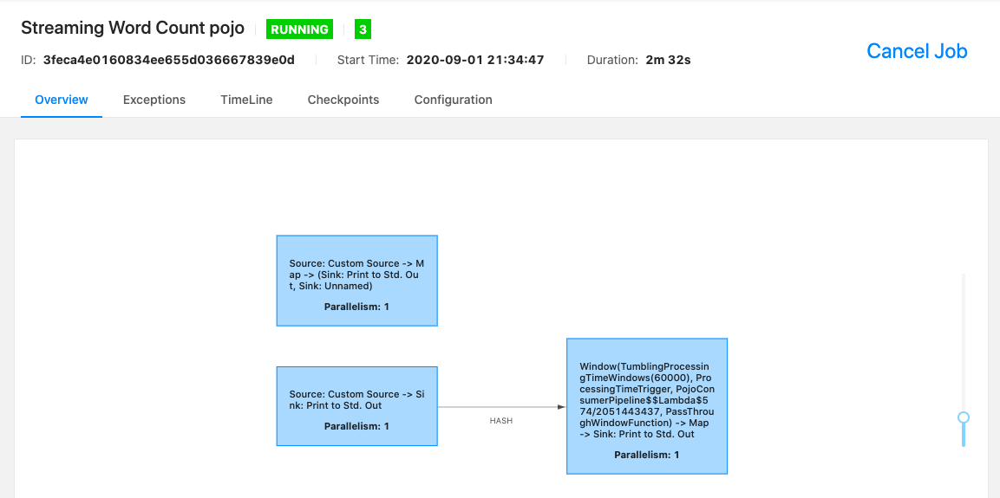
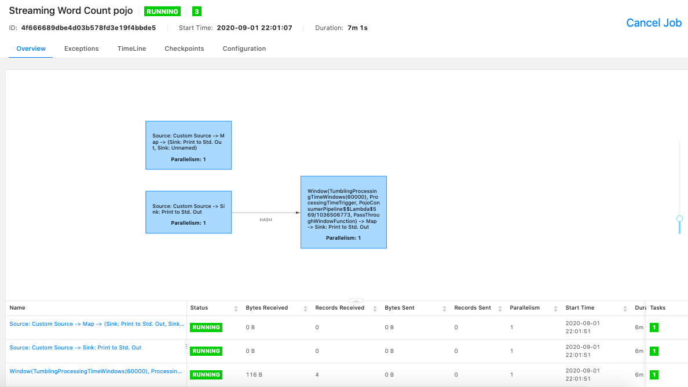

# Processing JSON

Make sure you follow all the **[requirements](../../../../README.md)**.

In this example we'll have two jobs.
One that read data, create objects and insert them in Kafka.
And other that read objects from Kafka, reduce them by recipient and print
results.

## Running pods

Create all the pods with the following command:

```shell
$ kustomize build .kube/flink-jobs/json-job/ | kubectl apply -f -
```

Verify Kafka pods are running (It can take some minutes to pull and run all the images).

```shell
$ kubel get pods -n kafka -w
NAME                                          READY   STATUS    RESTARTS   AGE
my-cluster-entity-operator-6dcdd644b8-b4z69   3/3     Running   0          11s
my-cluster-kafka-0                            2/2     Running   0          45s
my-cluster-zookeeper-0                        1/1     Running   0          2m20s
strimzi-cluster-operator-7d6cd6bdf7-bj7st     1/1     Running   0          5m12s
```

Check Flink pods too.

```shell
$ kubel get pods -n default
NAME                                READY   STATUS      RESTARTS   AGE
cluster-job-submit-95shk            0/1     Completed   0          93s
wordcount-cluster-9f7bbff46-k556w   1/1     Running     0          63s
wordcount-cluster-taskmanager-1-1   1/1     Running     0          10s
```

As you can see, `cluster-job-submit-95shk` is `completed` which means it has
already created all the required pods.
> Take a look the
[Job Documentation](https://kubernetes.io/docs/concepts/workloads/controllers/job/)
for more information about it.

Run the following commands to forward `8081` connections to the Job Manager.

```shell
$ jobmanager_pod=$(kubectl get pods -l component=jobmanager --output=jsonpath='{.items[*].metadata.name}')
$ kubectl port-forward $jobmanager_pod 8081
Forwarding from 127.0.0.1:8081 -> 8081
Forwarding from [::1]:8081 -> 8081
```

After that you can access http://localhost:8081 and you should see something
like the following image:



Here we'll see that 2 jobs are running into the same execution environment.

## Inserting messages

Now we can insert some messages in Kafka to see our job processing it.
We do it with the following command:

```shell
$ kubectl -n kafka run kafka-producer -ti --image=strimzi/kafka:0.19.0-kafka-2.5.0 \
--rm=true --restart=Never -- bin/kafka-console-producer.sh \
--broker-list my-cluster-kafka-bootstrap:9092 --topic pojo-input
If you don't see a command prompt, try pressing enter.
>Ricardo,my message 1
>Ricardo,my message 2
>Ricardo,my message 3
>Lohmann,my message 4
```

Now we can see that our job received and processed the messages we insert in
`pojo-input` topic (4 records sent).



We can see if the POJO objects were sent to Kafka by the following command:

```shell
$ kubectl -n kafka run kafka-consumer -ti --image=strimzi/kafka:0.19.0-kafka-2.5.0 \
--rm=true --restart=Never -- bin/kafka-console-consumer.sh \
--bootstrap-server my-cluster-kafka-bootstrap:9092 --from-beginning \
--topic pojo-output
```

You should see something like the following:

```shell
{"recipient":"Ricardo","message":"my message 1"}
{"recipient":"Ricardo","message":"my message 2"}
{"recipient":"Ricardo","message":"my message 3"}
{"recipient":"Lohmann","message":"my message 4"}
```

## Validating results

We can do it by watching the Task Managers logs.

```shell
$ kubectl logs -f -l component=taskmanager
```

The last logs should be something like the logs bellow:

```shell
POJO Produced messages> Message{recipient='Ricardo', message='my message 1'}
POJO Consumed messages> Message{recipient='Ricardo', message='my message 1'}
POJO Produced messages> Message{recipient='Ricardo', message='my message 2'}
POJO Consumed messages> Message{recipient='Ricardo', message='my message 2'}
POJO Produced messages> Message{recipient='Ricardo', message='my message 3'}
POJO Consumed messages> Message{recipient='Ricardo', message='my message 3'}
POJO Produced messages> Message{recipient='Lohmann', message='my message 4'}
POJO Consumed messages> Message{recipient='Lohmann', message='my message 4'}
Print counters> Message{recipient='Ricardo', message='my message 1
my message 2
my message 3'}
Print counters> Message{recipient='Lohmann', message='my message 4'}
```

`POJO Produced messages` are generated in Producer Job and
`POJO Consumed messages` are generated in Consumer Job. You'll see that messages
are consumed right after they were inserted in Kafka.

`Print counters` prints the reduce result.
