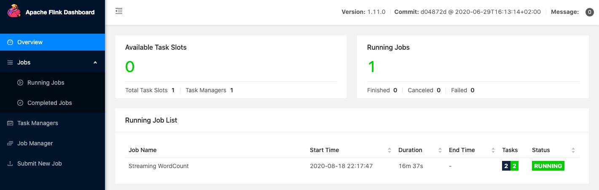
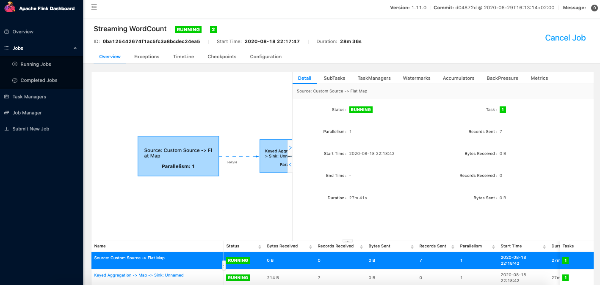

# Processing Strings

Make sure you follow all the **[requirements](../../../../README.md)**.

In this example we'll insert words as `String` and produce word counters as
`String` too.

## Running pods

Create all the pods with the following command:

```shell
$ kustomize build .kube/flink-jobs/string-job/ | kubectl apply -f -
```

Verify Kafka pods are running (It can take some minutes to pull and run all the images).

```shell
$ kubel get pods -n kafka -w
NAME                                          READY   STATUS    RESTARTS   AGE
my-cluster-entity-operator-6dcdd644b8-b4z69   3/3     Running   0          11s
my-cluster-kafka-0                            2/2     Running   0          45s
my-cluster-zookeeper-0                        1/1     Running   0          2m20s
strimzi-cluster-operator-7d6cd6bdf7-bj7st     1/1     Running   0          5m12s
```

Check Flink pods too.

```shell
$ kubel get pods -n default
NAME                                READY   STATUS      RESTARTS   AGE
cluster-job-submit-95shk            0/1     Completed   0          93s
wordcount-cluster-9f7bbff46-k556w   1/1     Running     0          63s
wordcount-cluster-taskmanager-1-1   1/1     Running     0          10s
```

As you can see, `cluster-job-submit-95shk` is `completed` which means it has already
created all the required pods.
> Take a look the
[Job Documentation](https://kubernetes.io/docs/concepts/workloads/controllers/job/)
for more information about it.

Run the following commands to forward `8081` connections to the Job Manager.

```shell
$ jobmanager_pod=$(kubectl get pods -l component=jobmanager --output=jsonpath='{.items[*].metadata.name}')
$ kubectl port-forward $jobmanager_pod 8081
Forwarding from 127.0.0.1:8081 -> 8081
Forwarding from [::1]:8081 -> 8081
```

After that you can access http://localhost:8081 and you should see something
like the following image:



## Inserting messages

Now we can insert some messages in Kafka to see our job processing it.

Insert some messages in the topic by executing the following command and typing
some words.

```shell
$ kubectl -n kafka run kafka-producer -ti --image=strimzi/kafka:0.19.0-kafka-2.5.0 --rm=true --restart=Never -- bin/kafka-console-producer.sh --broker-list my-cluster-kafka-bootstrap:9092 --topic words
If you don't see a command prompt, try pressing enter.
>one
>another
>one
>another
>one
>one
>other
```

Now we can see that our job received and processed the words we insert in
`words` topic (7 records sent).



## Consuming messages

After messages were inserted, you can see the result by executing the following command.

```shell
$ kubectl -n kafka run kafka-consumer -ti --image=strimzi/kafka:0.19.0-kafka-2.5.0 \
--rm=true --restart=Never -- bin/kafka-console-consumer.sh \
--bootstrap-server my-cluster-kafka-bootstrap:9092 --from-beginning \
--topic wordcount
```

> It's counting words per minute, so, your counters may take a minute to appear
in the topic.

You should see something like the following:

```shell
(one,4)
(another,2)
(other,1)
```
